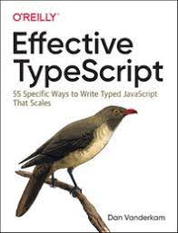

# Effective TypeScirpt 정리

  

    
  

## ✔ 독서 및 정리 계획

* 책과 TypeScript 공식 Documentation을 기반으로 학습하며 기록할 것입니다.
* 학습한 것을 작성하면서 Reference는 꼭 남기려고 합니다.
* 기간은 4주를 넘기지 않습니다. (21.10.13 - 21.11.13)

### 🐰TypeScript 정리 기록 

|            chapter            |             링크             |
| :---------------------------: | :--------------------------: |
|    Chapter1. 타입스크립트 알아보기     | [:link:](./record/chapter1.md) |
| Chapter2. 타입스크립트의 타입 시스템 |     [:link:](./record/)      |
|    Chapter3. 타입 추론   |     [:link:](./record/)      |
| Chapter4. 타입 설계  |     [:link:](./record/)      |
|     Chapter5. any 다루기     |      [:link:](./record)      |
| Chapter6. 타입 선언과 @types  |      [:link:](./record)      |
| Chapter7. 코드를 작성하고실행하기  |      [:link:](./record)      |
| Chapter8. 타입스크립트로 마이그레이션 하기  |      [:link:](./record)      |