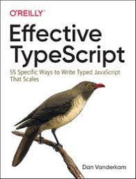

# 타입스크립트 알아보기

Effective typescript의 chapter1을 읽고 정리한 내용입니다. 

<code>
	<div>
		<p align='center'>
			
		</p>
	</div>
</code>

## 📌 1. 타입스크립트와 자바스크립의 관계 이해하기

### ✅ 요약

- 타입스크립트는 자바스크립트의 상위 집합이다. 모든 자바스크립트 프로그램은 이미 타입스크립트 프로그램이다. 반대로, 타입스크립트 프로그램은 별도의 문법을 가지고 있기 때문에 일반적으로는 유효한 자바스크립트 프로그램이 아니다.
- 타입스크립트는 자바스크립트 런타임 동작을 모델링하는 타입 시스템을 가지고 있기 때문에 런타임 오류를 발생시키는 코드를 찾아내려고 한다. 그러나 모든 오류를 찾지는 못한다. 타입 체커를 통과하면서도 런타임 오률를 발생시키는 코드는 충분히 존재할 수 있다.
- 타입스크립트 타입시스템은 전반적으로 자바스크립트 동작을 모델링한다. 그러나 잘못된 매개 변수 개수로 함수를 호출하는 경우처럼, 자바스크립트에서는 허용 되지만 타입스크립트에서는 문제가 되는 경우도 있다.

> 자바스크립트 프로그램에 어떠한 이슈가 존재한다면 문법적인 오류가 아니더라도 타입 체커에 지적당할 가능성이 높다.
> 

> 타입스크립트는 초깃값으로부터 타입을 추론한다.
> 

> 타입스크립트 타입 시스템은 자바스크립트이 런타임 동작을 '모델링' 한다.
> 

---

## 📌 2. 타입스크립트 설정 이해 하기

컴파일러 설정 파일 `tsconfig.json`

```jsx
{
	"compilerOptions": {
		"noImplicityAny": true
	}
}
```

> 가급적 설정 파일을 사용하는 것이 좋다. 그래야 타입스크립트를 어떻게 사용할 계획인지 다른 동료 또는 도구가 알 수 있기 때문이다.
> 

**설정 파일은** 

```bash
tsc --init
```

위의 구문을 통해 간단히 생성 가능하다. 

### ✔ **타입스크립트의 설정**

- 어디서 소스 파일을 찾을지
- 어떤 종류의 출력을 생성할 지
- 언어 자체의 핵심 요소들 제어하는 설정

타입스크립트의 설정을 제대로 사용하기 위해서는 `noImplicitAny`와 `strictNullChecks`를 이해해야한다.

### ✔ **noImplicitAny**

변수들이 미리 정의된 타입을 가져아하는지 여부를 제어한다.  타입스크립트는 정보를 가질 때 가장 효과적이기 때문에, 되도록이면 **noImplicitAny**를 설정해야한다. 

### ✔ **noImplicitAny** 의 효과

- 코드를 작성할 때마다 타입을 명시해야한다.
- 타입스크립트가 문제를 발견하기 수월해진다.
- 코드의 가독성이 좋아진다.
- 개발자의 생산성이 향상된다. ****

### ✔ **strictNullChecks**

**strictNullChecks은** null과 undefined가 모든 타입에서 허용되는지 확인하는 설정이다.

 ****

**strictNullChecks가 해제 되었을 때 유효한 코드**

```jsx
const x: number = null; // 정상, null은 유효한 값입니다.
```

**strictNullChecks가 설정 후 오류 코드**

```jsx
const x: number = null; // ~ 오류 'null'형식은 'number' 형식에 할당할 수 없습니다.
```

null 대신 undefined를 써도 같은 오류가 난다. 만약에 null을 허용하려고 한다면 명시적으로 드러냄으로 오류를 고칠 수 있다.

```jsx
const x: number | null = null;
```

만약 null을 허용하지 않으려면, 이 값이 어디서부터 왔는지 찾아야하며, null을 체크하는 코드나 단언문(assertion)을 추가해야한다.

```jsx
const el = document.getElementById('status');
el.textContent = 'Ready';
// ~~ 오류: 개체가 null 인것 같습니다.

if (el) {
	el.textContent = 'Ready'; // 정상, null은 제외됩니다.
}
el!.textContent = 'Ready'; // 정상, el이 null이 아님을 단언합니다.
```

> **strictNullChecks는 null과 undefined 관련된 오류를 잡아 내는 데 많은 도움이 되지만, 코드 작성을 어렵게 한다.

새로운 프로젝트를 시작하는 경우에는 strictNullChecks 설정하는 것이 좋지만, 자바스크립트 코드를 마이그레이션 하는 중인 경우에는 설정하지 않아도 괜찮다.

strictNullChecks를 설정하려면 noImplicitAny를 먼저 설정해야한다.**
> 

**strictNullChecks 설정 없이 개발하기로 선택했다면, undefined는 객체가 아닙니다. 라는 런타임 오류를 주의해야한다. 하지만 결국 이 오류 때문에 엄격한 체크를 할 수 밖에 없게 된다.** 

타입스크립트 컴파일러에서는 언어에 의미적으로 영향을 미치는 설정들이 많지만 **noImpliceitAny**와 **strictNullCheck**만큼 중요한 것은 없다. 

### ✅ 요약

- 타입스크립트 컴파일러는 언어의 핵심 요소에 영향을 미치는 몇가지 설정을 포함하고 있다.
- 타입스크립트 설정은 커맨드 라인을 이용하기 보다는 `tsconfig.json` 을 사용하는 것이 좋다.
- 자바스크립트 프로젝트를 타입스크립트로 마이그레이션 하는 것이 아니라면 **noImplicitAny** 를 설정하는 것이 좋다.
- "undefined"는 객체가 아닙니다 같은 런타임 오류를 방지하기 위해 strictNullchecks를 설정하는 것이 좋다.
- 타입스크립트에서 엄격한 체크를 하고 싶다면 `strict`설정을 고려해야 한다.

## 📌 3. 코드 생성과 타입이 관계없음을 이해하기

크게 타입스크립트 컴파일러는 두 가지 역할을 수행한다.

- 최신 타입스크립트/자바스크립트를 브라우저에서 동작할 수 있도록 구버전의 자바스크립트로 **[⁽¹⁾트랜스파일](https://www.notion.so/1-4499db447c44406da38ca77c33958487)**한다.
- 코드의 타입 오류를 체크한다.

위의 두 가지는 완벽하게 독립적이다.

1. ['트랜스 파일' 번역과 컴파일이 합쳐져 트랜스파일이라는 신조어가 탄생. 소스코드를 동일한 동작을 하는 다른 형태의 소스코드로 변환하는 행위를 의미한다. 결과물은 여전히 컴파일 되어야하는 소스코드이기 때문에 컴파일과는 구분해서 부름](https://www.notion.so/1-4499db447c44406da38ca77c33958487)

### ✔ 타입 오류가 있는 코드도 컴파일이 가능하다

컴파일과 타입 체크와 독립적으로 동작하기 때문에, 타입 오류가 있는 코드도 컴파일이 가능하다. 

> 타입 오류가 있는 데도 컴파일 되는 것이 도움이 되는 부분도 있다.

웹 앱을 만들면서 어떤 부분에 문제가 발생했을 경우, 타입스크립트는 여전히 컴파일 된 산출물을 생성하기 때문에, 문제가 된 오류를 수정하지 않더라도 앱의 다른 부분을 테스트 할 수 있습니다.
> 

### ✔ 런타임에는 타입 체크가 불가능하다.

```tsx
interface Square {
	width: number;
}

interface Rectangle extends Squre {
	height: number;
}

type Shape = Square | Rectangle;

function calculateArea(shape: Shape) {
	if (shape instanceof Rectangle) {
				//  ~~~ Rectangle 형식만 참조하지만 여기서는 값으로 사용되고 있습니다.
		return shape.width * shape.height // ~~~ shape 형식에 height 속성이 없습니다.
	} else {
		return shape.width * shape.width;
	}
}
```

**유니온 타입을 통해 해결**

```tsx
interface Square {
	kind: 'square';
	width: number;
}

interface Rectangle {
	kind: 'rectangle';
	height: number;
	width: number;
}

type Shape = Square | Rectangle;

function calculateArea(shape: Shape) {
	if (shape.kind === 'rectangle') {
		shape; // 타입이 Rectangle
		return shape.width * shape.height;
	} else {
		shape;
		return shape.width * shape.width
	}
}
```

> **tagged Union : 여기서의 shape는 태그된 유니온 기법이다. 이 기법은 런터임에 타입 정보를 손쉽게 유지할 수 있기 때문에, 타입스크립트에서 흔하게 접할 수 있다.**
> 

타입 (런타입 접근 불가)와 값(런타입 접근 가능)을 둘 다 사용하는 기법도 있다.

**타입을 클래스로 만들기**

```tsx
class Square {
	constructor(public width: number) {}
}

class Rectangle extends Square {
	constructor(public width: number, public height: number) {
		super(width);
	}
}

type Shape = Square | Rectangle;

function calculateArea(shape: Shape) {
	if (shape instanof Rectangle) {
		shape;
		return shape.width * shape.height;
	} else {
		shape; // 타입이 Square
		return shape.width * shape.width // 정상
	}
}
```

인터페이스는 타입으로만 사용 가능하지만, Rectangle을 클래스로 선언하면 타입과 값으로 모두 사용 할 수 있으므로 오류가 없다.

```tsx
type Shape = Square | Rectangle
```

Rectangle은 타입으로 참조되지만, shape instanceof Rectangle부분에서는 값으로 참조 된다.

### ✔ 타입 연산은 런타임에 영향을 주지 않는다.

아래 코드는 타입 체커를 통과하지만 잘못된 방법을 사용했다. 

```tsx
function asNumber(val:number | string): number {
	return val as number;
}
```

**올바른 방법**

```tsx
function asNumber(val:number | string): number {
	return typeof(val) === 'string' ? Number(val) : val;
}
```

### ✔ 런타임 타입은 선언된 타입과 다를 수 있다.

```tsx
interface LightApiResponse {
	lightSwitchValue: boolean;
}

async function setLight() {
	const response = await fetch('/light');
	const result: LightApiResponse = await response.json();
	setLightSwitch(result.lightSwitchValue);
}
```

> 타입스크립트에서는 런타임 타임과 선언된 타입이 맞지 않을 수 있다. 타입이 달라지는 혼란스러운 상황을 가능한 피해야 한다. 선언된 타입이 언제든지 달라질 수 있다는 것을 명심하고 있어야 한다.
> 

### ✔ 타입스크립트 타입으로는 함수를 오버로드할 수 없다.

동일한 이름에 매개변수만 다른 여러 버전의 함수를 허용하는 것을 '함수' 오버로딩이라 한다. 그러나 타입스크립트에서는 타입과 런타임의 동작이 무관하기 때문에, 함수 오버로딩은 불가능하다. 

```tsx
function add(a: number, b: number) { return a + b };
	// ~~ 중복된 함수 구현입니다.

function add(a: string, b: string) { return a + b };
	// ~~ 중복된 함수 구현입니다.
```

타입스크립트가 함수 오버로딩 기능을 지원하지만, 온전히 타입 수준에서만 동작한다.

> 하나의 함수에 대해 여러 개의 선언문을 작성할 수 있는 것은 `'구현체'` 오직 하나 뿐이다.
> 

### ✔타입스크립트 타입은 런타임 성능에 영향을 주지 않는다.

타입과 타입 연산자는 자바스크립트 변환 시점에 제거 되기 때문에, 런타임의 성능에 아무런 영향을 주지 않습니다.

- 런타임 오버헤드가 없는 대신, 타입스크립트 컴파일러는 '빌드타임' 오버헤드가 있다.
- 코드 생성은 타입 시스템과 무관하다. 타입스크립트 타입은 런타임 동작이나 성능에 영향을 주지 않는다.
- 타입 오류가 존재하더라도 코드 생성(컴파일)은 가능하다.
- 타입스크립트 타입은 런타임에 사용할 수 없다. 런타임에 타입을 지정하려면, 타입 정보 유지를 위한 별도의 방법이 필요하다.
    - 일반적으로 태그된 유니온 방법과 속성 체크 방법을 사용한다. 클래스 같이 타입스크립트 타입과 런타임 값, 둘 다 제공하는 방법이 있다.

## ❗4. 구조적 타이핑에 익숙해지기

**구조적 타이핑**: 코드 구조 관점에서 타입이 서로 호환되는지 판단한다. 구조적으로 더 큰 타입은 작은 타입을 호환 할 수 없다.

```tsx
interface Jangwon {
	name: 'string',
	age: 'string'
}

interface Person {
	name: 'string'
}

const developer: Janwgon;
const person: Person;

developer = peason; // ~~ Error
person = developer // ~~ 정상
```

 

- 자바스크립트가 덕 타이핑 기반이고 타입스크립트가 이를 모델링하기 위해 구조적 타이핑을 사용해야함을 이해야한다.
- 어떤 인터페이스에 할당 가능한 값이라면 타입 선언에 명시적으로 나열된 속성들을 가지고 있다. 이는 타입이 `'봉인'` 되어 있지 않다는 것을 의미한다.
- 클래스 역시 구조적 타이핑 규칙을 따른다는 것을 명심해야한다. 클래스의 인스턴스가 예상과는 다를수 있다.
- 구조적 타이핑을 사용하면 유닛 테스팅을 손쉽게 할 수 있다.

**덕 타이핑**

객체가 어떤 타입에 부합하는 변수와 메서드를 가질 경우 객체를 해당 타입에 속하는 것으로 간주하는 방식. 

## 📌 5. any 타입 지양하기

타입스크립트의 타입 시스템은 점진적이고 선택적이다. 코드에 타입을 조금씩 추가할 수 있기 때문에 점진적이며, 언제든지 타입 체커를 해제할 수 있기 때문에 선택적이다. 이러한 기능들의 핵심은 any이다. 

```tsx
let age: number;
age = '12';

// ~~~ '12' 형식은 'number' 형식에 할당할 수 없습니다. 
age = '12' as any; // ok 
```

타입 체커를 통해 코드의 오류를 잡았고 이를 해결하기 위해서 `as any` 를 추가하여 해결하였다.  

any타입이나 타입 단언문(as any)를 사용하면 타입스크립트의 수많은 장점을 누릴 수 없게 된다. 

**any의 위험성**

### ✔ any 타입에는 타입 안정성이 없습니다.

age는 number타입으로 선언하였다. as any를 사용하면 string 타입을 할당 할 수 있게 된다.

### ✔ any는 함수 시그니처를 무시하게 된다.

함수를 작성하는 경우에는 시그니처를 명시해야한다. 호출하는 쪽은 약속된 타입의 입력을 제공하고, 함수는 약속된 타입의 출력을 반환한다. 

### ✔ any 타입에는 언어 서비스가 적용되지 않는다.

어떤 심벌에 타입이 있다면 타입스크립트 언어 서비스는 자동완성 기능과 적절한 도움말을 제공한다.

그러나 any타입인 심벌을 사용하면 아무런 도움을 받을 수 없다.

### ✔ any 타입은 코드 리팩터링때 버그를 감춘다.

### ✔ any는 타입 설계를 감춰버린다.

앱 상태 같은 객체를 정의하려면 꽤 복잡하다. 상태 객체 안에 있는 수많은 속성의 타입을 일일이 작성해야하는데, any 타입을 사용하면 간단히 끝내 버릴 수도 있다. 

하지만 이때도 any를 사용하면 안된다. 객체를 정의할 때 특히 문제가 되는데, 상태 객체의 설계를 감춰버리기 때문이다. 

- **any타입은 상태 객체의 설계를 감춘다.**
- **any타입을 사용하면 타입 설계가 불 분명해진다.**

> any타입을 지양하여 설계를 명확하게 만들어야한다.
> 

### ✅ 요약

- any는 타입시스템의 신뢰도를 떨어뜨린다.
- any 타입을 사용하면 타입 체커와 타입스크립트 언어 서비스를 무력화시켜 버린다.
- any타입은 문제점을 감추며, 개발 경험을 나쁘게 하며 타입 시스템의 신뢰도를 떨어뜨린다.

# 📍References

- [**https://www.samsungsds.com/kr/insights/TypeScript.html**](https://www.samsungsds.com/kr/insights/TypeScript.html)
- **이펙티브 타입스크립트 (도서)**